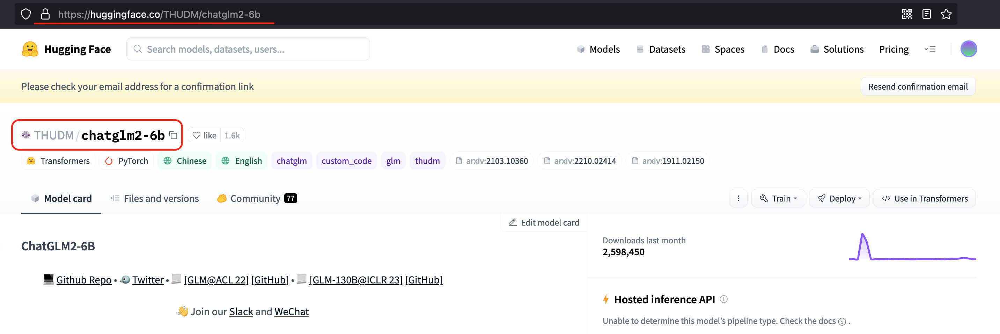

<!-- markdownlint-disable first-line-h1 -->
<!-- markdownlint-disable html -->

<div align="center">
<h1>
calflops: a FLOPs and Params calculate tool for neural networks
</h1>
</div>


[](https://pypi.org/project/calflops/)
[](https://github.com/MrYxJ/calculate-flops.pytorch/blob/main/LICENSE)

<h4 align="center">
    <p>
        <b>English</b> |
        <a href="https://github.com/MrYxJ/calculate-flops.pytorch/blob/main/README_CN.md">中文</a>
    <p>
</h4>


# Introduction
This tool(calflops) is designed to compute the theoretical amount of FLOPs(floating-point operations)、MACs(multiply-add operations) and Parameters in all various neural networks, such as Linear、 CNN、 RNN、 GCN、**Transformer(Bert、LlaMA etc Large Language Model)**，even including **any custom models** via ```torch.nn.function.*``` as long as based on the Pytorch implementation. Meanwhile this tool supports the printing of FLOPS, Parameter calculation value and proportion of each submodule of the model, it is convient for users to understand the performance consumption of each part of the model.

Latest news, calflops has launched a tool on Huggingface Space, which is more convenient for computing FLOPS in the model of 🤗Huggingface Platform. Welcome to use it:https://huggingface.co/spaces/MrYXJ/calculate-model-flops


For LLM, this is probably the easiest tool to calculate FLOPs and it is very convenient for **huggingface** platform models. You can use ```calflops.calculate_flops_hf(model_name)``` by `model_name` which in [huggingface models](https://huggingface.co/models) to calculate model FLOPs without downloading entire model weights locally.Notice this method requires the model to support the empty model being created for model inference in meta device.


``` python
from calflops import calculate_flops_hf

model_name = "meta-llama/Llama-2-7b"
access_token = "..." # your application token for using llama2
flops, macs, params = calculate_flops_hf(model_name=model_name, access_token=access_token) # default input shape: (1, 128)
print("%s FLOPs:%s  MACs:%s  Params:%s \n" %(model_name, flops, macs, params))
```


If model can't inference in meta device,  you just need assign llm corresponding tokenizer to the parameter: ```transformers_tokenizer``` to pass in funcional of ```calflops.calculate_flops()```, and it will automatically help you build the model input data whose size is input_shape.  Alternatively, you also can pass in the input data of models which need multi data as input that you have constructed.


In addition, the implementation process of this package inspired by [ptflops](https://github.com/sovrasov/flops-counter.pytorch)、[deepspeed](https://github.com/microsoft/DeepSpeed/tree/master/deepspeed)、[hf accelerate](https://github.com/huggingface/accelerate) libraries, Thanks for their great efforts, they are both very good work. Meanwhile this package also improves some aspects to calculate FLOPs based on them.

## How to install
### Install the latest version
#### From PyPI:

```python
pip install calflops
```

And you also can download latest `calflops-*-py3-none-any.whl` files from https://pypi.org/project/calflops/ 

```python
pip install calflops-*-py3-none-any.whl
```

## How to use calflops

### Example
### CNN Model
If model has only one input, you just need set the model input size by parameter ```input_shape``` , it can automatically generate random model input to complete the calculation:

```python
from calflops import calculate_flops
from torchvision import models

model = models.alexnet()
batch_size = 1
input_shape = (batch_size, 3, 224, 224)
flops, macs, params = calculate_flops(model=model, 
                                      input_shape=input_shape,
                                      output_as_string=True,
                                      output_precision=4)
print("Alexnet FLOPs:%s   MACs:%s   Params:%s \n" %(flops, macs, params))
#Alexnet FLOPs:4.2892 GFLOPS   MACs:2.1426 GMACs   Params:61.1008 M 
```

If the model has multiple inputs, use the parameters ```args``` or ```kargs```, as shown in the Transfomer Model below.


### Calculate Huggingface Model By Model Name(Online)

No need to download the entire parameter weight of the model to the local, just by the model name can test any open source large model on the huggingface platform.


```python
from calflops import calculate_flops_hf

batch_size, max_seq_length = 1, 128
model_name = "baichuan-inc/Baichuan-13B-Chat"

flops, macs, params = calculate_flops_hf(model_name=model_name, input_shape=(batch_size, max_seq_length))
print("%s FLOPs:%s  MACs:%s  Params:%s \n" %(model_name, flops, macs, params))
```

You can also use this model urls of huggingface platform to calculate it FLOPs.



```python
from calflops import calculate_flops_hf

batch_size, max_seq_length = 1, 128
model_name = "https://huggingface.co/THUDM/chatglm2-6b" # THUDM/chatglm2-6b
flops, macs, params = calculate_flops_hf(model_name=model_name, input_shape=(batch_size, max_seq_length))
print("%s FLOPs:%s  MACs:%s  Params:%s \n" %(model_name, flops, macs, params))
```

There are some model uses that require an application first, and you only need to pass the application in through the ```access_token``` to calculate its FLOPs.


```python
from calflops import calculate_flops_hf

batch_size, max_seq_length = 1, 128
model_name = "meta-llama/Llama-2-7b"
access_token = "" # your application for using llama2

flops, macs, params = calculate_flops_hf(model_name=model_name,
                                         access_token=access_token,
                                         input_shape=(batch_size, max_seq_length))
print("%s FLOPs:%s  MACs:%s  Params:%s \n" %(model_name, flops, macs, params))
```


### Transformer Model (Local)

Compared to the CNN Model, Transformer Model if you want to use the parameter ```input_shape``` to make calflops automatically generating the input data, you should pass its corresponding tokenizer through the parameter ```transformer_tokenizer```.

``` python
# Transformers Model, such as bert.
from calflops import calculate_flops
from transformers import AutoModel
from transformers import AutoTokenizer

batch_size, max_seq_length = 1, 128
model_name = "hfl/chinese-roberta-wwm-ext/"
model_save = "../pretrain_models/" + model_name
model = AutoModel.from_pretrained(model_save)
tokenizer = AutoTokenizer.from_pretrained(model_save)

flops, macs, params = calculate_flops(model=model, 
                                      input_shape=(batch_size,max_seq_length),
                                      transformer_tokenizer=tokenizer)
print("Bert(hfl/chinese-roberta-wwm-ext) FLOPs:%s   MACs:%s   Params:%s \n" %(flops, macs, params))
#Bert(hfl/chinese-roberta-wwm-ext) FLOPs:67.1 GFLOPS   MACs:33.52 GMACs   Params:102.27 M 
```

If you want to use your own generated specific data to calculate FLOPs, you can use
parameter ```args``` or ```kwargs```，and parameter ```input_shape``` can no longer be assigned to pass in this case. Here is an example that can be seen is inconvenient comparedt to use parameter```transformer_tokenizer```.


``` python
# Transformers Model, such as bert.
from calflops import calculate_flops
from transformers import AutoModel
from transformers import AutoTokenizer


batch_size, max_seq_length = 1, 128
model_name = "hfl/chinese-roberta-wwm-ext/"
model_save = "/code/yexiaoju/generate_tags/models/pretrain_models/" + model_name
model = AutoModel.from_pretrained(model_save)
tokenizer = AutoTokenizer.from_pretrained(model_save)

text = ""
inputs = tokenizer(text,
                   add_special_tokens=True, 
                   return_attention_mask=True,
                   padding=True,
                   truncation="longest_first",
                   max_length=max_seq_length)

if len(inputs["input_ids"]) < max_seq_length:
    apply_num = max_seq_length-len(inputs["input_ids"])
    inputs["input_ids"].extend([0]*apply_num)
    inputs["token_type_ids"].extend([0]*apply_num)
    inputs["attention_mask"].extend([0]*apply_num)
    
inputs["input_ids"] = torch.tensor([inputs["input_ids"]])
inputs["token_type_ids"] = torch.tensor([inputs["token_type_ids"]])
inputs["attention_mask"] = torch.tensor([inputs["attention_mask"]])

flops, macs, params = calculate_flops(model=model,
                                      kwargs = inputs,
                                      print_results=False)
print("Bert(hfl/chinese-roberta-wwm-ext) FLOPs:%s   MACs:%s   Params:%s \n" %(flops, macs, params))
#Bert(hfl/chinese-roberta-wwm-ext) FLOPs:22.36 GFLOPS   MACs:11.17 GMACs   Params:102.27 M 
```


### Large Language Model

#### Online

```python
from calflops import calculate_flops_hf

batch_size, max_seq_length = 1, 128
model_name = "meta-llama/Llama-2-7b"
access_token = "" # your application for using llama 

flops, macs, params = calculate_flops_hf(model_name=model_name,
                                         access_token=access_token,
                                         input_shape=(batch_size, max_seq_length))
print("%s FLOPs:%s  MACs:%s  Params:%s \n" %(model_name, flops, macs, params))
```

#### Local
Note here that the tokenizer must correspond to the llm model because llm tokenizer processes maybe are different.

``` python
#Large Languase Model, such as llama2-7b.
from calflops import calculate_flops
from transformers import LlamaTokenizer
from transformers import LlamaForCausalLM

batch_size, max_seq_length = 1, 128
model_name = "llama2_hf_7B"
model_save = "../model/" + model_name
model = LlamaForCausalLM.from_pretrained(model_save)
tokenizer = LlamaTokenizer.from_pretrained(model_save)
flops, macs, params = calculate_flops(model=model,
                                      input_shape=(batch_size, max_seq_length),
                                      transformer_tokenizer=tokenizer)
print("Llama2(7B) FLOPs:%s   MACs:%s   Params:%s \n" %(flops, macs, params))
#Llama2(7B) FLOPs:1.7 TFLOPS   MACs:850.00 GMACs   Params:6.74 B 
```

### Show each submodule result of FLOPs、MACs、Params

The calflops provides a more detailed display of model FLOPs calculation information. By setting the parameter ```print_result=True```, which defaults to True, flops of the model will be printed in the terminal or jupyter interface.


Meanwhile, by setting the parameter ```print_detailed=True``` which default to True, the calflops supports the display of the calculation results and proportion of FLOPs、MACs and Parameter in each submodule of the entire model, so that it is convenient to see the largest part of the calculation consumption in the entire model.


### More use introduction

<details>
<summary> How to make output format more elegant </summary>
You can use parameter output_as_string、output_precision、output_unit to determine the format of output data is value or string, if it is string, how many bits of precision to retain and the unit of value, such as FLOPs, the unit of result is "TFLOPs" or "GFLOPs", "MFLOPs".

</details>

<details>
<summary> How do deal with model has multiple inputs </summary>
The calflops support  multiple inputs of model, just use parameter args or kwargs to construct multiple inputs can be passed in as model inference.
</details>

<details>
<summary> How to calculate the results of FLOPS include forward and backward pass of the model </summary>
You can use the parameter include_backPropagation to select whether the calculation of FLOPs results includes the process of model backpropagation. The default is False, that is result of FLOPs only include forward pass. 

In addition, the parameter compute_bp_factor to determine how many times backward as much computation as forward pass.The defaults that is 2.0, according to https://epochai.org/blog/backward-forward-FLOP-ratio
</details>

<details>
<summary> How to calculate FLOPs for only part of the model module </summary>
You can use the parameter ignore_modules to select which modules of model are ignored during FLOPs calculation. The default is [], that is all modules of model would be calculated in results.
</details>

<details>
<summary> How to calculate FLOPs of the generate function in LLM  </summary>
You just need to assign "generate" to parameter forward_mode.
</details>

### **API** of the **calflops**

<details>
<summary> calflops.calculate_flops() </summary>

``` python
from calflops import calculate_flops

def calculate_flops(model,
                    input_shape=None,
                    transformer_tokenizer=None,
                    args=[],   
                    kwargs={},
                    forward_mode="forward",
                    include_backPropagation=False,
                    compute_bp_factor=2.0,         
                    print_results=True,
                    print_detailed=True,
                    output_as_string=True,
                    output_precision=2,
                    output_unit=None,
                    ignore_modules=None):
    
    """Returns the total floating-point operations, MACs, and parameters of a model.

    Args:
        model ([torch.nn.Module]): The model of input must be a PyTorch model.
        input_shape (tuple, optional): Input shape to the model. If args and kwargs is empty, the model takes a tensor with this shape as the only positional argument. Default to [].
        transformers_tokenizer (None, optional): Transforemrs Toekenizer must be special if model type is transformers and args、kwargs is empty. Default to None
        args (list, optinal): list of positional arguments to the model, such as bert input args is [input_ids, token_type_ids, attention_mask]. Default to []
        kwargs (dict, optional): dictionary of keyword arguments to the model, such as bert input kwargs is {'input_ids': ..., 'token_type_ids':..., 'attention_mask':...}. Default to {}
        forward_mode (str, optional): To determine the mode of model inference, Default to 'forward'. And use 'generate' if model inference uses model.generate().
        include_backPropagation (bool, optional): Decides whether the final return FLOPs computation includes the computation for backpropagation.
        compute_bp_factor (float, optional): The model backpropagation is a multiple of the forward propagation computation. Default to 2.
        print_results (bool, optional): Whether to print the model profile. Defaults to True.
        print_detailed (bool, optional): Whether to print the detailed model profile. Defaults to True.
        output_as_string (bool, optional): Whether to print the output as string. Defaults to True.
        output_precision (int, optional) : Output holds the number of decimal places if output_as_string is True. Default to 2.
        output_unit (str, optional): The unit used to output the result value, such as T, G, M, and K. Default is None, that is the unit of the output decide on value.
        ignore_modules ([type], optional): the list of modules to ignore during profiling. Defaults to None.
```
</details>


<details>
<summary> calflops.calculate_flops_hf() </summary>

``` python
def calculate_flops_hf(model_name,
                       input_shape=None,
                       library_name="transformers",
                       trust_remote_code=True,
                       access_token="",
                       forward_mode="forward",
                       include_backPropagation=False,
                       compute_bp_factor=2.0,
                       print_results=True,
                       print_detailed=True,
                       output_as_string=True,
                       output_precision=2,
                       output_unit=None,
                       ignore_modules=None):
    
    """Returns the total floating-point operations, MACs, and parameters of a model.

    Args:
        model_name (str): The model name in huggingface platform https://huggingface.co/models, such as meta-llama/Llama-2-7b、baichuan-inc/Baichuan-13B-Chat etc.
        input_shape (tuple, optional): Input shape to the model. If args and kwargs is empty, the model takes a tensor with this shape as the only positional argument. Default to [].
        trust_remote_code (bool, optional): Trust the code in the remote library for the model structure.
        access_token (str, optional): Some models need to apply for a access token, such as meta llama2 etc.
        forward_mode (str, optional): To determine the mode of model inference, Default to 'forward'. And use 'generate' if model inference uses model.generate().
        include_backPropagation (bool, optional): Decides whether the final return FLOPs computation includes the computation for backpropagation.
        compute_bp_factor (float, optional): The model backpropagation is a multiple of the forward propagation computation. Default to 2.
        print_results (bool, optional): Whether to print the model profile. Defaults to True.
        print_detailed (bool, optional): Whether to print the detailed model profile. Defaults to True.
        output_as_string (bool, optional): Whether to print the output as string. Defaults to True.
        output_precision (int, optional) : Output holds the number of decimal places if output_as_string is True. Default to 2.
        output_unit (str, optional): The unit used to output the result value, such as T, G, M, and K. Default is None, that is the unit of the output decide on value.
        ignore_modules ([type], optional): the list of modules to ignore during profiling. Defaults to None.

    Example:
    .. code-block:: python
    from calflops import calculate_flops_hf
    
    batch_size = 1
    max_seq_length = 128
    model_name = "baichuan-inc/Baichuan-13B-Chat"
    flops, macs, params = calculate_flops_hf(model_name=model_name,
                                            input_shape=(batch_size, max_seq_length))
    print("%s FLOPs:%s  MACs:%s  Params:%s \n" %(model_name, flops, macs, params))

    Returns:
        The number of floating-point operations, multiply-accumulate operations (MACs), and parameters in the model.
    """    
```
</details>


<details>
<summary> calflops.generate_transformer_input()</summary>

``` python
def generate_transformer_input(model_tokenizer, input_shape, device):
    """Automatically generates data in the form of transformes model input format.
    
    Args:
        input_shape (tuple):transformers model input shape: (batch_size, seq_len).
        tokenizer (transformer.model.tokenization): transformers model tokenization.tokenizer.

    Returns:
        dict: data format of transformers model input, it is a dict which contain 'input_ids', 'attention_mask', 'token_type_ids' etc.
    """
```
</details>


</details>

## Citation
if calflops was useful for your paper or tech report, please cite me:
```
@online{calflops,
  author = {xiaoju ye},
  title = {calflops: a FLOPs and Params calculate tool for neural networks in pytorch framework},
  year = 2023,
  url = {https://github.com/MrYxJ/calculate-flops.pytorch},
}
```

## Common model calculate flops

### Large Language Model
Input data format: batch_size=1, seq_len=128

- fwd FLOPs: The FLOPs of the model forward propagation

- bwd + fwd FLOPs: The FLOPs of model forward and backward propagation

In addition, note that fwd + bwd does not include calculation losses for model parameter  activation recomputation, if the results wants to include activation recomputation that is only necessary to multiply the result of fwd FLOPs by 4(According to the paper: https://arxiv.org/pdf/2205.05198.pdf), and in calflops you can easily set parameter ```computer_bp_factor=3 ```to make the result of including the activate the recalculation.


Model         | Input Shape | Params(B)|Params(Total)| fwd FLOPs(G) | fwd MACs(G) | fwd + bwd FLOPs(G) | fwd + bwd MACs(G)  | 
---           |---          |---       |---          |---         |---       |---        |--- 
bloom-1b7     |(1,128)      | 1.72B    | 1722408960  | 310.92     | 155.42   | 932.76    | 466.27
bloom-7b1     |(1,128)      | 7.07B    | 7069016064  | 1550.39    | 775.11   | 4651.18   | 2325.32
bloomz-1b7    |(1,128)      | 1.72B    | 1722408960  | 310.92     | 155.42   | 932.76    | 466.27
baichuan-7B   |(1,128)      | 7B       | 7000559616  | 1733.62    | 866.78   | 5200.85   | 2600.33
chatglm-6b    |(1,128)      | 6.17B    | 6173286400  | 1587.66    | 793.75   | 4762.97   | 2381.24
chatglm2-6b   |(1,128)      | 6.24B    | 6243584000  | 1537.68    | 768.8    | 4613.03   | 2306.4 
Qwen-7B       |(1,128)      | 7.72B    | 7721324544  | 1825.83    | 912.88   | 5477.48   | 2738.65
llama-7b      |(1,128)      | 6.74B    | 6738415616  | 1700.06    | 850      | 5100.19   | 2550
llama2-7b     |(1,128)      | 6.74B    | 6738415616  | 1700.06    | 850      | 5100.19   | 2550   
llama2-7b-chat |(1,128)     | 6.74B    | 6738415616  | 1700.06    | 850      | 5100.19   | 2550
chinese-llama-7b | (1,128)  | 6.89B    | 6885486592  | 1718.89    | 859.41   |5156.67   | 2578.24
chinese-llama-plus-7b| (1,128) | 6.89B | 6885486592  | 1718.89    | 859.41   |5156.67   | 2578.24
EleutherAI/pythia-1.4b | (1,128) | 1.31B | 1311625216  | 312.54    | 156.23   |937.61   | 468.69
EleutherAI/pythia-12b | (1,128) | 11.59B | 11586549760  | 2911.47    | 1455.59   | 8734,41 | 4366.77
moss-moon-003-sft |(1,128) | 16.72B  | 16717980160 |  4124.93    | 2062.39  |  12374.8  | 6187.17
moss-moon-003-sft-plugin |(1,128) | 16.06B  | 16060416000 |  3956.62    | 1978.24  |   11869.9  | 5934.71

We can draw some simple and interesting conclusions from the table above:
- The chatglm2-6b in the model of the same scale, the model parameters are smaller, and FLOPs is also smaller, which has certain advantages in speed performance.
- The parameters of the llama1-7b, llama2-7b, and llama2-7b-chat models did not change at all, and FLOPs remained consistent. The structure of the model that conforms to the 7b described by [meta in its llama2 report](https://ai.meta.com/research/publications/llama-2-open-foundation-and-fine-tuned-chat-models/) has not changed, the main difference is the increase of training data tokens.
- Similarly, it can be seen from the table that the chinese-llama-7b and chinese-llama-plus-7b data are also in line with [cui's report](https://arxiv.org/pdf/2304.08177v1.pdf), just more chinese data tokens are added for training, and the model structure and parameters do not change.

- ......

More model FLOPs would be updated successively, see github [calculate-flops.pytorch](https://github.com/MrYxJ/calculate-flops.pytorch)

### Bert

Input data format: batch_size=1, seq_len=128

Model         | Input Shape | Params(M)|Params(Total)| fwd FLOPs(G) | fwd MACs(G) | fwd + bwd FLOPs(G) | fwd + bwd MACs(G)  | 
---           |---          |---       |---          |---        |---       |---     |---
hfl/chinese-roberta-wwm-ext | (1,128)| 102.27M | 102267648 | 22.363 | 11.174 | 67.089 | 33.523   | 
......

You can use calflops to calculate the more different transformer models based bert, look forward to updating in this form.


## Benchmark
### [torchvision](https://pytorch.org/docs/1.0.0/torchvision/models.html)

Input data format: batch_size = 1, actually input_shape = (1, 3, 224, 224)

Note: The FLOPs in the table only takes into account the computation of forward propagation of the model, **Total** refers to the total numerical representation without unit abbreviations.

Model         | Input Resolution | Params(M)|Params(Total) | FLOPs(G) | FLOPs(Total) | Macs(G) | Macs(Total) 
---           |---               |---        |---          |---     |---          |---     |---
alexnet       |224x224           | 61.10     | 61100840    | 1.43   | 1429740000  | 741.19 | 7418800000
vgg11         |224x224           | 132.86    | 132863000   | 15.24  | 15239200000 | 7.61   | 7609090000
vgg13         |224x224           | 133.05    | 133048000   | 22.65  | 22647600000 | 11.31  | 11308500000
vgg16         |224x224           | 138.36    | 138358000   | 30.97  | 30973800000 | 15.47  | 15470300000
vgg19         |224x224           | 143.67    | 143667000   | 39.30  | 39300000000 | 19.63  | 19632100000
vgg11_bn      |224x224           | 132.87    | 132869000   | 15.25  | 15254000000 | 7.61   | 7609090000
vgg13_bn      |224x224           | 133.05    | 133054000   | 22.67  | 22672100000 | 11.31  | 11308500000
vgg16_bn      |224x224           | 138.37    | 138366000   | 31.00  | 31000900000 | 15.47  | 15470300000
vgg19_bn      |224x224           | 143.68    | 143678000   | 39.33  | 39329700000 | 19.63  | 19632100000
resnet18      |224x224           | 11.69     | 11689500    | 3.64   | 3636250000  | 1.81   | 1814070000
resnet34      |224x224           | 21.80     | 21797700    | 7.34   | 7339390000  | 3.66   | 3663760000
resnet50      |224x224           | 25.56     | 25557000    | 8.21   | 8211110000  | 4.09   | 4089180000
resnet101     |224x224           | 44.55     | 44549200    | 15.65  | 15690900000 | 7.80   | 7801410000
resnet152     |224x224           | 60.19     | 60192800    | 23.09  | 23094300000 | 11.51  | 11513600000
squeezenet1_0 |224x224           | 1.25      | 1248420     | 1.65   | 1648970000  | 0.82   | 818925000
squeezenet1_1 |224x224           | 1.24      | 1235500     | 0.71   | 705014000   | 0.35   | 349152000
densenet121   |224x224           | 7.98      | 7978860     | 5.72   | 5716880000  | 2.83   | 2834160000
densenet169   |224x224           | 14.15     | 14195000    | 6.78   | 6778370000  | 3.36   | 3359840000
densenet201   |224x224           | 20.01     | 20013900    | 8.66   | 8658520000  | 4.29   | 4291370000
densenet161   |224x224           | 28.68     | 28681000    | 15.55  | 1554650000  | 7.73   | 7727900000
inception_v3  |224x224           | 27.16     | 27161300    | 5.29   | 5692390000  | 2.84   | 2837920000

Thanks to @[zigangzhao-ai](https://github.com/zigangzhao-ai) use ```calflops``` to static torchvision form. 

You also can compare torchvision results of calculate FLOPs with anthoer good tool: [ptflops readme.md](https://github.com/sovrasov/flops-counter.pytorch/).


## Concact Author

Author: [MrYXJ](https://github.com/MrYxJ/)

Mail: yxj2017@gmail.com
